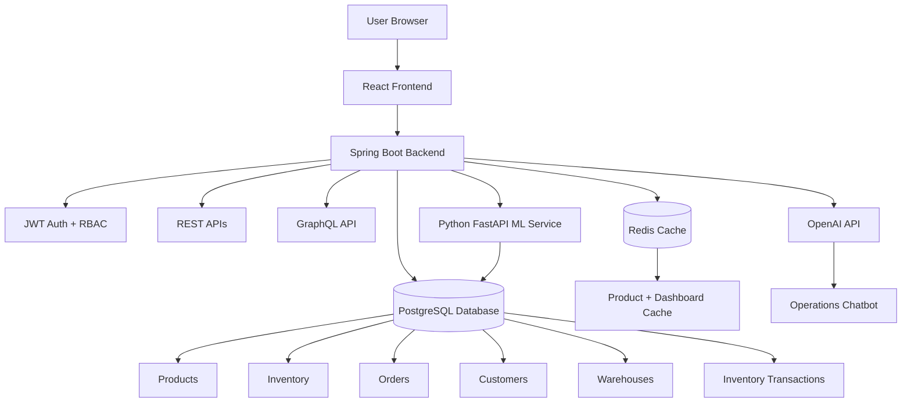
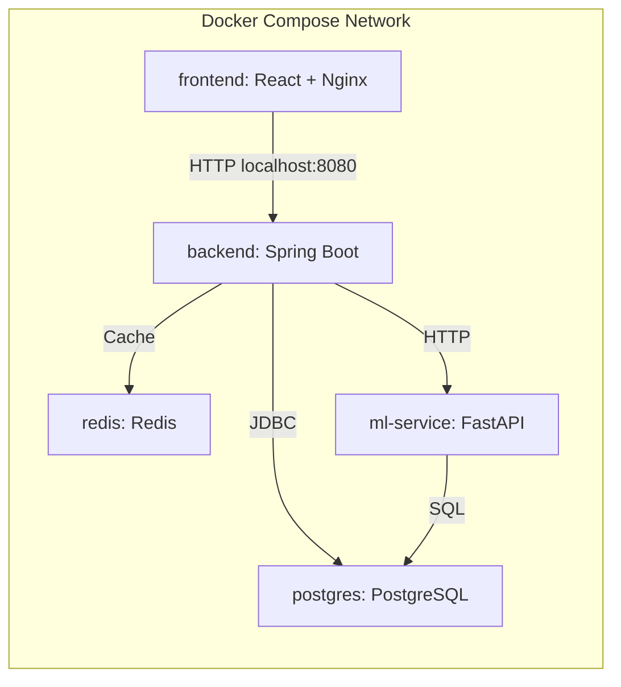
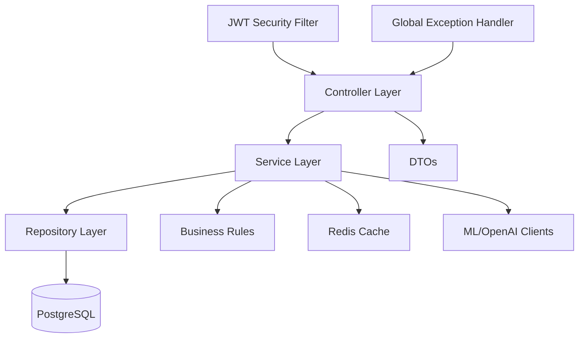
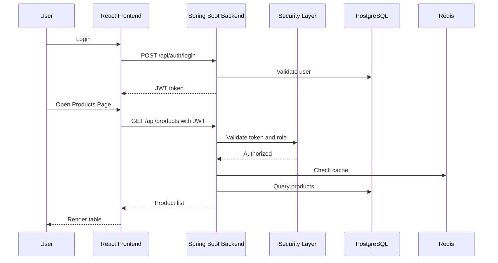
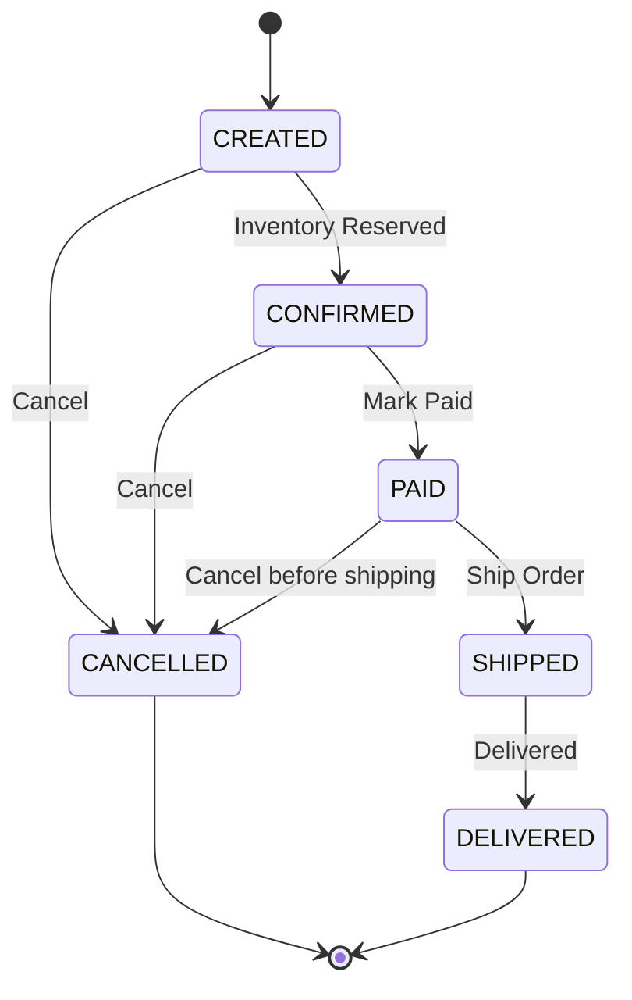
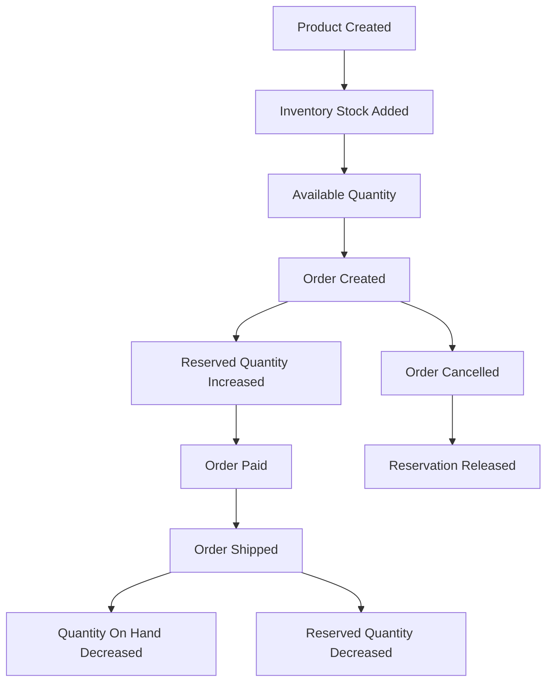
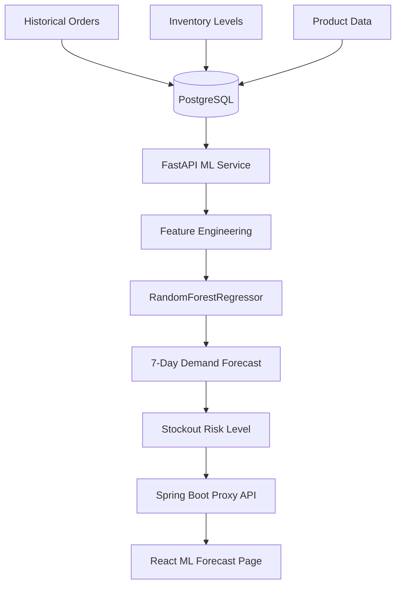
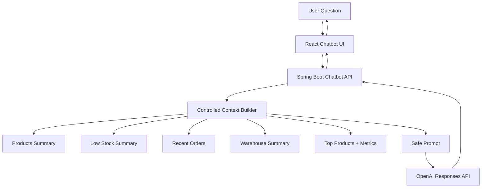
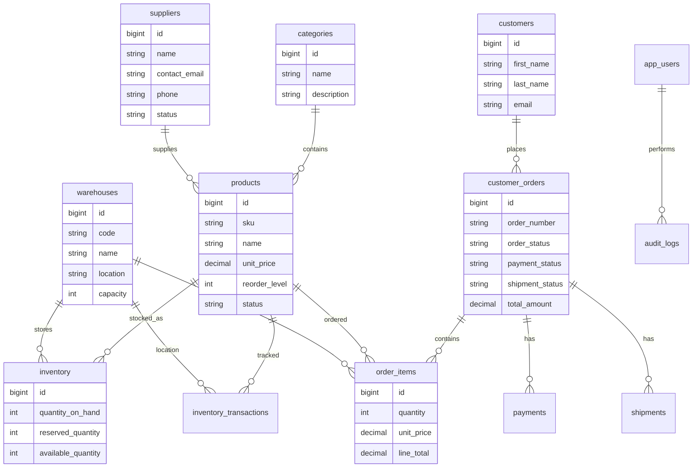
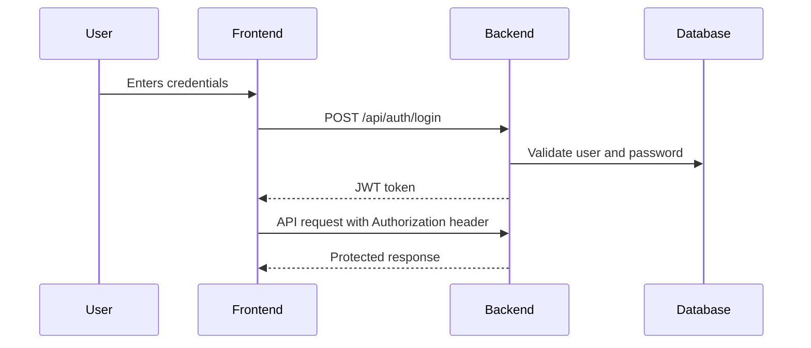

# Enterprise Inventory & Order Management System

A full-stack enterprise-grade inventory and order management platform built with **Spring Boot, React, PostgreSQL, Redis, GraphQL, Docker, Python ML, and OpenAI**.

This project simulates a real business operations system where an organization can manage products, suppliers, warehouses, inventory levels, customers, orders, analytics, demand forecasting, and AI-powered operational assistance.

---

## Project Overview

The goal of this project is to build a production-style system that combines:

- Backend API development
- Relational database design
- Caching
- Authentication and authorization
- GraphQL APIs
- Full-stack frontend dashboard
- Analytics and reporting
- Machine learning demand forecasting
- OpenAI-powered chatbot
- Dockerized multi-service architecture

The system is designed around a realistic enterprise workflow:

1. Admins manage products, suppliers, and warehouses.
2. Warehouse teams track inventory and stock movement.
3. Sales users create customer orders.
4. The system reserves inventory when orders are created.
5. Orders can be paid, shipped, or cancelled.
6. Inventory is automatically updated based on business actions.
7. Analytics dashboards summarize business performance.
8. ML service predicts demand and stockout risk.
9. AI chatbot answers operational questions using controlled backend data.

---

## Live Local URLs

After running the project with Docker Compose:

| Service | URL |
|---|---|
| Frontend | http://localhost:3000 |
| Backend API | http://localhost:8080 |
| GraphQL | http://localhost:8080/graphql |
| GraphiQL | http://localhost:8080/graphiql |
| ML Service | http://localhost:8090 |
| ML Health | http://localhost:8090/health |

---

## Tech Stack

### Backend

| Area | Technology |
|---|---|
| Language | Java 21 |
| Framework | Spring Boot |
| API | REST, GraphQL |
| Security | Spring Security, JWT, RBAC |
| Database | PostgreSQL |
| ORM | Spring Data JPA, Hibernate |
| Migrations | Flyway |
| Cache | Redis |
| Validation | Jakarta Validation |
| Build Tool | Maven |
| Containerization | Docker |

### Frontend

| Area | Technology |
|---|---|
| Framework | React |
| Language | TypeScript |
| Build Tool | Vite |
| Styling | Tailwind CSS |
| Routing | React Router |
| Charts | Recharts |
| Icons | Lucide React |

### Machine Learning

| Area | Technology |
|---|---|
| Language | Python |
| API Framework | FastAPI |
| Data Processing | Pandas, NumPy |
| ML Model | RandomForestRegressor |
| Database Access | psycopg2 |
| Containerization | Docker |

### AI Chatbot

| Area | Technology |
|---|---|
| AI Provider | OpenAI |
| Backend Integration | Spring Boot REST Client |
| Safety Design | Controlled backend context |
| Frontend | React Chat UI |

### DevOps

| Area | Technology |
|---|---|
| Local Orchestration | Docker Compose |
| Services | Backend, Frontend, PostgreSQL, Redis, ML Service |
| Environment Config | `.env` |
| Deployment | Local Docker-first setup |

---

## Main Features

### Product Management

- Create products
- View product catalog
- Search/filter products through backend APIs
- Assign category and supplier
- Set unit price and reorder level
- Soft delete products by marking them discontinued

### Inventory Management

- Track inventory by product and warehouse
- View quantity on hand
- View reserved quantity
- View available quantity
- Detect low-stock items
- Adjust stock manually
- Reserve stock for orders
- Release reserved stock
- Transfer stock between warehouses
- Record inventory transactions

### Order Management

- Create customer orders
- Add products from specific warehouses
- Automatically reserve inventory
- Calculate line totals and order totals
- Mark orders as paid
- Ship orders
- Cancel orders
- Release inventory when orders are cancelled
- Deduct stock when orders are shipped

### Authentication and Authorization

- JWT-based authentication
- Role-based access control
- Protected backend APIs
- Protected frontend routes
- Demo users for multiple roles

### Analytics Dashboard

- Revenue trend
- Order status breakdown
- Top-selling products
- Warehouse inventory distribution
- Low-stock risk table
- Business intelligence dashboard

### Machine Learning Forecasting

- Python FastAPI ML service
- Reads historical order and inventory data from PostgreSQL
- Predicts 7-day demand
- Estimates daily demand
- Calculates stockout risk
- Recommends reorder quantity
- Labels inventory risk as HIGH, MEDIUM, or LOW

### OpenAI Chatbot

- AI operations assistant
- Answers questions about:
  - Low stock
  - Recent orders
  - Warehouse inventory
  - Top products
  - Operational priorities
- Backend sends only approved business context to OpenAI
- OpenAI API key stays server-side
- Frontend never sees the OpenAI key
- Fallback response works even without OpenAI key

---

## System Architecture



---

## Docker Architecture



---

## Backend Layered Architecture



---

## Request Flow



---

## Order Lifecycle



---

## Inventory Flow



---

## Machine Learning Forecasting Flow



---

## OpenAI Chatbot Flow



---

## Database ER Diagram



---

## Project Structure

```text
enterprise-inventory-order-management/
├── backend/
│   ├── Dockerfile
│   ├── pom.xml
│   └── src/main/
│       ├── java/com/enterprise/inventory/
│       │   ├── config/
│       │   ├── controller/
│       │   ├── dto/
│       │   ├── entity/
│       │   ├── enums/
│       │   ├── exception/
│       │   ├── repository/
│       │   ├── security/
│       │   └── service/
│       └── resources/
│           ├── application.yml
│           ├── db/migration/
│           └── graphql/schema.graphqls
│
├── frontend/
│   ├── Dockerfile
│   ├── nginx.conf
│   ├── package.json
│   └── src/
│       ├── components/
│       ├── lib/
│       ├── pages/
│       ├── App.tsx
│       ├── main.tsx
│       └── types.ts
│
├── ml-service/
│   ├── Dockerfile
│   ├── requirements.txt
│   └── app/
│       └── main.py
│
├── docker-compose.yml
├── .env.example
├── .gitignore
└── README.md
```

---

## Backend Modules

### Product Module

Handles:

- Product creation
- Product updates
- Product listing
- Category and supplier mapping
- Product soft delete
- Duplicate SKU validation

### Inventory Module

Handles:

- Stock listing
- Low-stock detection
- Manual stock adjustment
- Reservation
- Reservation release
- Warehouse transfer
- Inventory transaction history

### Order Module

Handles:

- Customer orders
- Order items
- Inventory reservation
- Payment status changes
- Shipment status changes
- Order cancellation
- Stock deduction on shipping

### Analytics Module

Handles:

- Revenue trend
- Order status breakdown
- Top products
- Warehouse inventory summary
- Low-stock risk

### Machine Learning Module

Handles:

- Backend proxy to Python ML service
- Demand forecast response
- Stockout risk response
- Reorder recommendation response

### Chatbot Module

Handles:

- User question
- Safe context generation
- OpenAI call
- Fallback response
- Chatbot answer

---

## Frontend Pages

| Page | Description |
|---|---|
| Login | JWT login with demo users |
| Dashboard | High-level system summary |
| Products | View, create, and discontinue products |
| Inventory | View inventory and adjust stock |
| Orders | Create orders, mark paid, ship, cancel |
| Analytics | Revenue, top products, warehouse charts |
| ML Forecast | Demand forecast and stockout risk |
| AI Chatbot | Ask operational questions |

---

## Demo Users

| Role | Email | Password |
|---|---|---|
| Admin | admin@inventory.com | admin123 |
| Manager | manager@inventory.com | manager123 |
| Warehouse Staff | warehouse@inventory.com | staff123 |
| Sales User | sales@inventory.com | sales123 |
| Customer Support | support@inventory.com | support123 |

---

## Role-Based Access Control

| Role | Access |
|---|---|
| ADMIN | Full access |
| MANAGER | Product, inventory, order, analytics access |
| WAREHOUSE_STAFF | Inventory operations |
| SALES_USER | Order creation and order management |
| CUSTOMER_SUPPORT | Read-only/customer support access |

---

## Setup Instructions

### Prerequisites

Install:

- Docker Desktop
- Git

Optional for local development:

- Java 21
- Maven
- Node.js 20+
- Python 3.12+

---

## Environment Variables

Create a `.env` file from the example:

```bash
cp .env.example .env
```

Example:

```env
POSTGRES_DB=inventory_db
POSTGRES_USER=inventory_user
POSTGRES_PASSWORD=inventory_password

SPRING_DATASOURCE_URL=jdbc:postgresql://postgres:5432/inventory_db
SPRING_DATASOURCE_USERNAME=inventory_user
SPRING_DATASOURCE_PASSWORD=inventory_password

SPRING_REDIS_HOST=redis
SPRING_REDIS_PORT=6379

ML_SERVICE_URL=http://ml-service:8090

OPENAI_API_KEY=your_openai_api_key_here
OPENAI_MODEL=gpt-4.1-mini
OPENAI_API_URL=https://api.openai.com/v1/responses
```

The OpenAI key is optional. Without it, the chatbot returns a safe fallback response.

Never commit `.env`.

---

## Run the Full Project

From the project root:

```bash
docker compose up --build
```

Open:

```text
http://localhost:3000
```

Login with:

```text
admin@inventory.com
admin123
```

---

## Stop the Project

```bash
docker compose down
```

To reset the fake database:

```bash
docker compose down -v
docker compose up --build
```

---

## API Endpoints

### Health

```http
GET /api/health
```

### Auth

```http
POST /api/auth/login
GET  /api/auth/me
```

### Products

```http
GET    /api/products
GET    /api/products/{id}
POST   /api/products
PUT    /api/products/{id}
DELETE /api/products/{id}
```

### Lookups

```http
GET /api/lookups/categories
GET /api/lookups/suppliers
GET /api/lookups/warehouses
GET /api/lookups/customers
```

### Inventory

```http
GET  /api/inventory
GET  /api/inventory/{id}
GET  /api/inventory/low-stock
POST /api/inventory/adjust
POST /api/inventory/reserve
POST /api/inventory/release
POST /api/inventory/transfer
```

### Orders

```http
GET  /api/orders
GET  /api/orders/{id}
POST /api/orders
POST /api/orders/{id}/cancel
POST /api/orders/{id}/mark-paid
POST /api/orders/{id}/ship
```

### Analytics

```http
GET /api/analytics/dashboard
GET /api/analytics/revenue-trend
GET /api/analytics/order-status
GET /api/analytics/top-products
GET /api/analytics/warehouse-inventory
GET /api/analytics/low-stock-risk
```

### Machine Learning

```http
GET /api/ml/demand-forecast
```

### Chatbot

```http
POST /api/chatbot/ask
```

---

## GraphQL

GraphQL endpoint:

```text
http://localhost:8080/graphql
```

GraphiQL UI:

```text
http://localhost:8080/graphiql
```

Example query:

```graphql
query {
  dashboardSummary {
    totalProducts
    activeProducts
    lowStockItems
    totalOrders
    pendingOrders
    shippedOrders
    totalCustomers
    totalWarehouses
    totalInventoryUnits
    totalOrderValue
  }
}
```

Example products query:

```graphql
query {
  products(page: 0, size: 5) {
    content {
      id
      sku
      name
      unitPrice
      status
      category {
        name
      }
      supplier {
        name
      }
    }
    totalElements
    totalPages
  }
}
```

Example order mutation:

```graphql
mutation {
  createOrder(
    input: {
      customerId: 1
      items: [
        {
          productId: 1
          warehouseId: 1
          quantity: 2
        }
      ]
      notes: "Created from GraphQL"
    }
  ) {
    id
    orderNumber
    orderStatus
    paymentStatus
    shipmentStatus
    totalAmount
  }
}
```

---

## Example cURL Commands

### Login

```bash
curl -X POST http://localhost:8080/api/auth/login \
  -H "Content-Type: application/json" \
  -d '{"email":"admin@inventory.com","password":"admin123"}'
```

### Save JWT Token

```bash
TOKEN=$(curl -s -X POST http://localhost:8080/api/auth/login \
  -H "Content-Type: application/json" \
  -d '{"email":"admin@inventory.com","password":"admin123"}' \
  | python3 -c "import sys, json; print(json.load(sys.stdin)['token'])")
```

### Get Products

```bash
curl "http://localhost:8080/api/products?page=0&size=5" \
  -H "Authorization: Bearer $TOKEN"
```

### Create Product

```bash
curl -X POST http://localhost:8080/api/products \
  -H "Authorization: Bearer $TOKEN" \
  -H "Content-Type: application/json" \
  -d '{
    "sku": "DEMO-SKU-001",
    "name": "Demo Product",
    "description": "Created from API",
    "categoryId": 1,
    "supplierId": 1,
    "unitPrice": 99.99,
    "reorderLevel": 10
  }'
```

### Adjust Inventory

```bash
curl -X POST http://localhost:8080/api/inventory/adjust \
  -H "Authorization: Bearer $TOKEN" \
  -H "Content-Type: application/json" \
  -d '{
    "productId": 1,
    "warehouseId": 1,
    "quantityChange": 20,
    "notes": "Manual restock"
  }'
```

### Create Order

```bash
curl -X POST http://localhost:8080/api/orders \
  -H "Authorization: Bearer $TOKEN" \
  -H "Content-Type: application/json" \
  -d '{
    "customerId": 1,
    "items": [
      {
        "productId": 1,
        "warehouseId": 1,
        "quantity": 2
      }
    ],
    "notes": "Test order"
  }'
```

### Get Analytics

```bash
curl http://localhost:8080/api/analytics/dashboard \
  -H "Authorization: Bearer $TOKEN"
```

### Get ML Forecast

```bash
curl http://localhost:8080/api/ml/demand-forecast \
  -H "Authorization: Bearer $TOKEN"
```

### Ask Chatbot

```bash
curl -X POST http://localhost:8080/api/chatbot/ask \
  -H "Authorization: Bearer $TOKEN" \
  -H "Content-Type: application/json" \
  -d '{"message":"Which products are low in stock and what should we do next?"}'
```

---

## Machine Learning Service

The ML service is a separate Python FastAPI service.

Direct ML health endpoint:

```bash
curl http://localhost:8090/health
```

Direct forecast endpoint:

```bash
curl http://localhost:8090/forecast
```

The ML service:

1. Reads product, warehouse, inventory, and order data from PostgreSQL.
2. Creates demand-related features.
3. Trains a RandomForestRegressor on generated historical demand.
4. Predicts 7-day demand.
5. Calculates estimated stockout timeline.
6. Recommends reorder quantity.
7. Returns HIGH, MEDIUM, or LOW risk.

Example forecast fields:

```json
{
  "sku": "BULK-SKU-0001",
  "productName": "Warehouse Scanner Model 1",
  "warehouseCode": "WH-NY",
  "availableQuantity": 120,
  "predictedDemand7Days": 15,
  "estimatedDaysUntilStockout": 56.0,
  "recommendedReorderQuantity": 0,
  "riskLevel": "LOW"
}
```

---

## OpenAI Chatbot Design

The chatbot is designed safely.

It does not directly access the database.

Instead:

1. User sends a question from the frontend.
2. Backend validates JWT.
3. Backend builds a controlled operational context.
4. Context includes:
   - Summary metrics
   - Low-stock items
   - Top products
   - Recent orders
   - Warehouse inventory
5. Backend sends the approved context and user question to OpenAI.
6. OpenAI returns a concise operational answer.
7. Backend returns the answer to the frontend.

This prevents exposing database credentials or raw unrestricted data to the AI model.

---

## Database Migrations

Flyway migrations create and seed the database.

Main migration responsibilities:

| Migration | Purpose |
|---|---|
| V1 | Core schema |
| V2 | Initial demo data |
| V3 | Order item warehouse support |
| V4 | Auth users |
| V5 | Large enterprise fake dataset |

The large dataset includes:

- 150+ products
- 300+ customers
- 800+ orders
- 1600+ order items
- Inventory across warehouses
- Payments
- Shipments
- Inventory transactions
- Audit logs

---

## Redis Caching

Redis is used for backend caching.

Cached data includes:

- Product detail responses
- Dashboard summary

Cache is evicted when data changes through:

- Product create/update/delete
- Inventory adjustment
- Inventory reservation
- Inventory transfer
- Order creation
- Order cancellation
- Order payment
- Order shipment

Redis health/status endpoint:

```http
GET /api/cache/status
```

---

## Security

Security features:

- JWT authentication
- Stateless sessions
- Password hashing with BCrypt
- Role-based API access
- Protected frontend routes
- CORS configuration
- Global exception handling
- Validation on request DTOs

JWT flow:



---

## Business Rules

Important business rules implemented:

- Product SKU must be unique.
- Product delete is soft delete.
- Inventory cannot be reserved if available quantity is insufficient.
- Order creation reserves inventory.
- Order cancellation releases reserved inventory.
- Shipping deducts stock and decreases reservation.
- Shipped orders cannot be cancelled.
- Low-stock status is calculated from available quantity and reorder level.
- Dashboard cache is cleared after business-changing operations.

---

## Troubleshooting

### Backend not starting

Check logs:

```bash
docker compose logs backend
```

Reset fake database:

```bash
docker compose down -v
docker compose up --build
```

---

### Frontend cannot login

Check backend health:

```bash
curl http://localhost:8080/api/health
```

Check login manually:

```bash
curl -i -X POST http://localhost:8080/api/auth/login \
  -H "Content-Type: application/json" \
  -d '{"email":"admin@inventory.com","password":"admin123"}'
```

---

### Token command fails

The token command fails when login does not return JSON.

Run login without Python parsing first:

```bash
curl -i -X POST http://localhost:8080/api/auth/login \
  -H "Content-Type: application/json" \
  -d '{"email":"admin@inventory.com","password":"admin123"}'
```

---

### Port already in use

Check port:

```bash
lsof -i :8080
lsof -i :3000
lsof -i :8090
```

Stop old containers:

```bash
docker stop $(docker ps -q)
```

Then restart:

```bash
docker compose up --build
```

---

### OpenAI chatbot returns fallback

That means the backend is working, but `OPENAI_API_KEY` is missing.

Add it to `.env`:

```env
OPENAI_API_KEY=your_real_key_here
```

Restart:

```bash
docker compose down
docker compose up --build
```

---

### ML service fails

Check logs:

```bash
docker compose logs ml-service
```

Test direct health:

```bash
curl http://localhost:8090/health
```

---

## Development Commands

### Backend local build

```bash
cd backend
mvn clean install
```

### Frontend local build

```bash
cd frontend
npm install
npm run build
```

### ML service local validation

```bash
cd ml-service
pip install -r requirements.txt
python -m compileall app
```

### Docker full build

```bash
docker compose up --build
```

---

## Screenshots

Add screenshots here after running the project locally.

```text
screenshots/
├── login.png
├── dashboard.png
├── products.png
├── inventory.png
├── orders.png
├── analytics.png
├── ml-forecast.png
└── chatbot.png
```

Suggested screenshots:

1. Login page
2. Dashboard cards
3. Products table
4. Inventory table
5. Order workflow
6. Analytics charts
7. ML forecast page
8. AI chatbot page

---

## What This Project Demonstrates

This project demonstrates practical full-stack engineering skills:

- Designing normalized relational schemas
- Building REST APIs
- Building GraphQL APIs
- Implementing JWT authentication
- Implementing role-based authorization
- Using Redis for caching
- Managing inventory consistency
- Handling order lifecycle workflows
- Creating real dashboard UIs
- Building analytics APIs
- Integrating a Python ML microservice
- Creating an OpenAI-powered assistant
- Dockerizing a multi-service application
- Writing production-style backend and frontend code

---

## Resume Description

```text
Built an enterprise inventory and order management platform using Spring Boot, React, PostgreSQL, Redis, GraphQL, Docker, and Python FastAPI, supporting product catalog management, warehouse inventory tracking, order processing, JWT authentication, analytics dashboards, ML-based demand forecasting, and an OpenAI-powered operations chatbot.
```

---

## Future Improvements

Possible next improvements:

- Add unit and integration tests
- Add pagination controls in frontend
- Add product update form
- Add advanced order item builder
- Add audit log UI
- Add email notifications for low stock
- Add file export for reports
- Add production deployment with AWS ECS/EKS
- Add CI/CD pipeline
- Add observability with Prometheus and Grafana

---

## Author

Built as a full-stack enterprise software engineering project to demonstrate backend systems, frontend dashboards, database design, caching, machine learning integration, AI integration, and Docker-based architecture.

